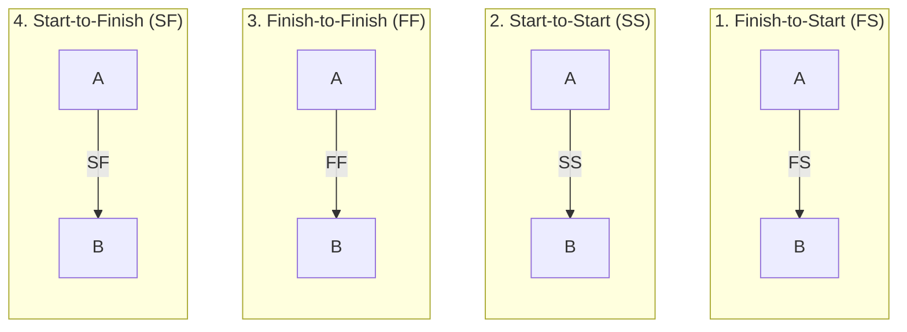

# Project Scheduling Basics

Project scheduling is a core competency tested on the PE Civil Transportation exam. Understanding activity relationships, precedence types, network formats, and basic scheduling terms is essential before performing full Critical Path Method (CPM) analyses.

---

## Elements of a Schedule

A project schedule is a model that translates project activities, durations, resources, and constraints into a time-based plan.

- **Activity (Task):** A cohesive unit of work that consumes time and resources.
- **Milestone:** A significant event or point in time. It has **zero duration** and consumes no resources.
- **Duration ($d$):** The estimated time required to complete an activity (usually measured in working days).
- **Predecessor:** An activity that must start or finish before another activity can begin or complete.
- **Successor:** An activity that cannot start or finish until another activity has started or completed.

---

## Precedence Relationships

Activities are linked using logical dependencies. There are four types of relationships, which can be modified by **lags** or **leads**.

### 1. Finish-to-Start (FS)
The successor activity cannot start until the predecessor activity finishes. This is the most common relationship.
- **Equation:** $ES_B \ge EF_A$
- **With Lag ($L$):** $ES_B \ge EF_A + L$ (Activity B can start $L$ days after Activity A finishes).

### 2. Start-to-Start (SS)
The successor activity cannot start until the predecessor activity starts.
- **Equation:** $ES_B \ge ES_A$
- **With Lag ($L$):** $ES_B \ge ES_A + L$ (Activity B can start $L$ days after Activity A starts). Common for overlapping tasks like excavation and pipe laying.

### 3. Finish-to-Finish (FF)
The successor activity cannot finish until the predecessor activity finishes.
- **Equation:** $EF_B \ge EF_A$
- **With Lag ($L$):** $EF_B \ge EF_A + L$ (Activity B can finish $L$ days after Activity A finishes).

### 4. Start-to-Finish (SF)
The successor activity cannot finish until the predecessor activity starts. This is rarely used in construction.
- **Equation:** $EF_B \ge ES_A$
- **With Lag ($L$):** $EF_B \ge ES_A + L$

---

## Lag and Lead Times

- **Lag Time:** A directed delay that requires an activity to wait a specified time after its predecessor's start/finish before starting/finishing itself (positive value).
  *Example:* Pour concrete (Activity A) must cure for 5 days before building forms (Activity B). This is a **Finish-to-Start relationship with a 5-day lag (FS + 5)**.
- **Lead Time:** A negative lag that allows a successor to begin before the predecessor is completely finished (negative value).
  *Example:* Lay asphalt (Activity B) can start 2 days before subgrade prep (Activity A) completes (FS - 2).

---

## Network Diagram Formats

There are two primary styles of scheduling network diagrams. The PE Civil exam almost exclusively uses AON.

### 1. Activity-on-Node (AON)
Activities are represented by geometric shapes (nodes/boxes), and dependencies are represented by arrows connecting the nodes.
- **Advantage:** Easy to represent all four precedence types and lags.
- **Node Anatomy:** A typical AON node contains key scheduling variables:

  <svg width="200" height="120" viewBox="0 0 200 120" xmlns="http://www.w3.org/2000/svg">
    
    <!-- Outer Box -->
    <rect x="10" y="10" width="180" height="100" class="node" />
    <!-- Horizontal Dividers -->
    <line x1="10" y1="40" x2="190" y2="40" class="line" />
    <line x1="10" y1="80" x2="190" y2="80" class="line" />    
    <!-- Vertical Dividers (Top Row) -->
    <line x1="50" y1="10" x2="50" y2="40" class="line" />
    <line x1="150" y1="10" x2="150" y2="40" class="line" />    
    <!-- Vertical Dividers (Bottom Row) -->
    <line x1="50" y1="80" x2="50" y2="110" class="line" />
    <line x1="150" y1="80" x2="150" y2="110" class="line" />    
    <!-- Texts Top Row -->
    <text x="30" y="30" class="text" text-anchor="middle">ES</text>
    <text x="100" y="30" class="text" text-anchor="middle">Duration (d)</text>
    <text x="170" y="30" class="text" text-anchor="middle">EF</text>    
    <!-- Activity Name -->
    <text x="100" y="65" class="text header" text-anchor="middle">Activity Name</text>    
    <!-- Texts Bottom Row -->
    <text x="30" y="100" class="text" text-anchor="middle">LS</text>
    <text x="100" y="100" class="text" text-anchor="middle">Total Float</text>
    <text x="170" y="100" class="text" text-anchor="middle">LF</text>
  </svg>

### 2. Activity-on-Arrow (AOA)
Activities are represented by arrows, and nodes (circles) represent events (the start or finish of activities).
- **Advantage:** Clear visual representation of events.
- **Disadvantage:** Can only represent Finish-to-Start relationships without lags. Requires the use of **dummy activities** (dashed arrows with zero duration) to maintain logic.

---

## Worked Example: Precedence and Lag Calculations

**Problem:**  
Activity X (duration = 6 days) begins at Day 0. It is connected to Activity Y (duration = 4 days) and Activity Z (duration = 5 days) under the following rules:
- Activity Y has a Start-to-Start relationship with Activity X with a 2-day lag (SS + 2).
- Activity Z has a Finish-to-Start relationship with Activity X with a 3-day lag (FS + 3).

Calculate the Early Start (ES) and Early Finish (EF) for Activities X, Y, and Z.

**Solution:**

*Note: We will use the 0-based scheduling convention where the project begins at Day 0.*

**Step 1: Calculate Activity X**
- $ES_X = 0$
- $EF_X = ES_X + d_X = 0 + 6 = 6\text{ days}$

**Step 2: Calculate Activity Y (SS + 2 with X)**
- Relationship: $ES_Y = ES_X + \text{Lag} = 0 + 2 = 2\text{ days}$
- $EF_Y = ES_Y + d_Y = 2 + 4 = 6\text{ days}$

**Step 3: Calculate Activity Z (FS + 3 with X)**
- Relationship: $ES_Z = EF_X + \text{Lag} = 6 + 3 = 9\text{ days}$
- $EF_Z = ES_Z + d_Z = 9 + 5 = 14\text{ days}$

---

## Schedule Compression Overview

When a schedule exceeds its allowable duration, it must be compressed. This can be achieved through two primary techniques:

1. **Fast-Tracking:** Performing activities in parallel that would normally be done in sequence.
   - *Pros:* No additional direct cost.
   - *Cons:* Increases risk, coordination complexity, and potential for rework.
2. **Crashing:** Shortening the duration of activities on the critical path by adding resources (overtime, extra equipment, labor).
   - *Pros:* Safely compresses duration.
   - *Cons:* Increases direct costs.

---

## Crucial Pitfalls and Exam Traps

- **0-Based vs. 1-Based Systems:** 
  - In a **0-based system**, if Activity A finishes at day 4, the next Finish-to-Start Activity B starts at day 4. (Formula: $EF = ES + d$).
  - In a **1-based system** (often used in project management textbooks), if Activity A finishes at day 4, Activity B starts at day 5. (Formula: $EF = ES + d - 1$).
  - *Exam Strategy:* Check the answer choices or NCEES handbook. If the NCEES handbook uses $EF = ES + t$, it is using the 0-based system. The 0-based system is significantly less error-prone when dealing with lags.
- **Applying Lags to the Wrong Dates:** Read the relationship carefully. A Start-to-Start lag adds to the *Early Start* of the predecessor. A Finish-to-Start lag adds to the *Early Finish*. Misapplying this is a major source of calculation errors.
