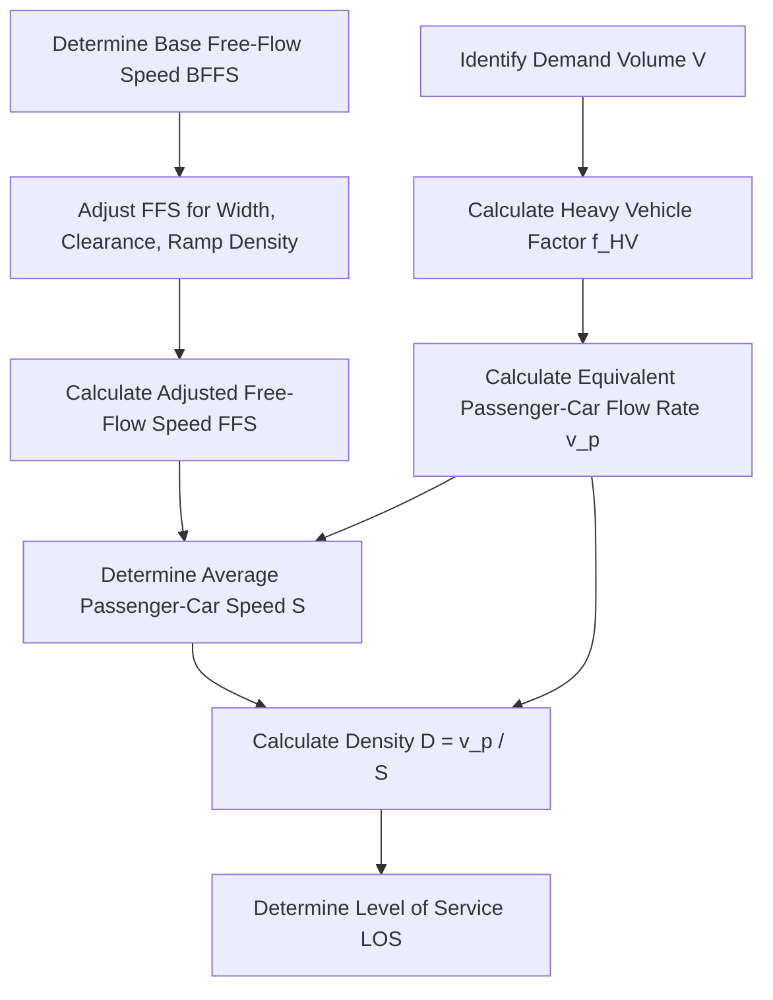

# Basic Freeway Segments

Basic freeway segments are outside the influence of merging, diverging, or weaving maneuvers. The operational analysis of basic freeway segments is a core topic on the NCEES PE Civil Transportation exam. The methodology is governed by Chapter 12 of the Highway Capacity Manual (HCM 6th Edition) and is summarized in the NCEES PE Civil Reference Handbook.

---

## The HCM Analysis Methodology

The operational analysis of a basic freeway segment follows a structured, step-by-step procedure to determine its Level of Service (LOS) and capacity:

---

## Step 1: Determine Free-Flow Speed (FFS)

Free-flow speed is the average speed of passenger cars measured when traffic volumes are low and drivers are not constrained by other vehicles. FFS can be measured directly in the field or estimated using the following equation:

$$\text{FFS} = \text{BFFS} - f_{LW} - f_{LC} - f_{TRD}$$

Where:
* $\text{FFS}$ = estimated free-flow speed ($mph$)
* $\text{BFFS}$ = base free-flow speed ($mph$); typically assumed to be $75 \text{ mph}$ for rural freeways and $70 \text{ mph}$ for urban freeways if not specified.
* $f_{LW}$ = adjustment for lane width ($mph$)
* $f_{LC}$ = adjustment for right-shoulder lateral clearance ($mph$)
* $f_{TRD}$ = adjustment for total ramp density ($mph$)

### 1. Lane Width Adjustment ($f_{LW}$)
Standard lane width is $12 \text{ ft}$. Lanes narrower than $12 \text{ ft}$ reduce free-flow speed:

| Average Lane Width (ft) | FFS Reduction, $f_{LW}$ (mph) |
| --- | --- |
| $\ge 12$ | 0.0 |
| $11$ | 1.9 |
| $10$ | 6.6 |

### 2. Lateral Clearance Adjustment ($f_{LC}$)
Obstructions (walls, guardrails, utility poles) close to the right shoulder cause drivers to slow down. The adjustment depends on the number of lanes in one direction ($N$) and the lateral clearance from the right-hand lane edge to the obstruction:

| Right-Shoulder Lateral Clearance (ft) | 2 Lanes | 3 Lanes | 4 Lanes | $\ge 5$ Lanes |
| --- | --- | --- | --- | --- |
| $\ge 6$ | 0.0 | 0.0 | 0.0 | 0.0 |
| $5$ | 0.6 | 0.4 | 0.2 | 0.1 |
| $4$ | 1.2 | 0.8 | 0.4 | 0.2 |
| $3$ | 1.8 | 1.2 | 0.6 | 0.3 |
| $2$ | 2.4 | 1.6 | 0.8 | 0.4 |
| $1$ | 3.0 | 2.0 | 1.0 | 0.5 |
| $0$ | 3.6 | 2.4 | 1.2 | 0.6 |

*Note: Left-shoulder (median) lateral clearance is assumed to have no effect on basic freeway segments.*

### 3. Total Ramp Density Adjustment ($f_{TRD}$)
Total Ramp Density (TRD) is the total number of on-ramps and off-ramps (in both directions) located within a 6-mile window (3 miles upstream and 3 miles downstream of the segment center) divided by 6 miles. 
The adjustment is calculated as:
$$f_{TRD} = 0.8 \times \text{TRD}$$
Where $\text{TRD}$ is expressed in ramps per mile.

---

## Step 2: Determine Equivalent Passenger-Car Flow Rate ($v_p$)

The hourly demand volume ($V$) must be adjusted to account for peak-hour variations, number of lanes, presence of heavy vehicles, and driver familiarity:

$$v_p = \frac{V}{\text{PHF} \times N \times f_{HV} \times f_p}$$

Where:
* $v_p$ = demand flow rate under equivalent passenger-car conditions ($pc/h/ln$)
* $V$ = hourly demand volume ($veh/h$)
* $\text{PHF}$ = Peak Hour Factor
* $N$ = number of lanes in one direction
* $f_{HV}$ = heavy vehicle adjustment factor
* $f_p$ = driver population adjustment factor (typically $1.00$ for familiar drivers/commuters; can range from $0.85$ to $1.00$ for recreational or unfamiliar driver populations).

### Heavy Vehicle Adjustment Factor ($f_{HV}$)
Heavy vehicles (trucks, buses, RVs) occupy more space and have lower acceleration capabilities than passenger cars. We convert them to passenger-car equivalents ($E_T$ and $E_R$):

$$f_{HV} = \frac{1}{1 + P_T(E_T - 1) + P_R(E_R - 1)}$$

Where:
* $P_T$ = proportion of trucks and buses in the traffic stream (expressed as a decimal)
* $P_R$ = proportion of recreational vehicles (RVs) in the traffic stream (expressed as a decimal)
* $E_T$ = passenger-car equivalent for trucks and buses
* $E_R$ = passenger-car equivalent for RVs

For general terrain analysis:
* **Level Terrain**: $E_T = 1.5$, $E_R = 1.2$
* **Rolling Terrain**: $E_T = 2.5$, $E_R = 2.0$

---

## Step 3: Determine Speed ($S$) and Density ($D$)

### Average Passenger-Car Speed ($S$)
Speed remains relatively constant at the FFS until the flow rate ($v_p$) exceeds a specific **breakpoint** (BP). If the flow rate is below the breakpoint, speed equals the FFS. If it exceeds the breakpoint, speed drops.

The HCM 6th Edition speed-flow relationships are defined by:

* **For $v_p \le \text{Breakpoint}$**:
  $$S = \text{FFS}$$
* **For $\text{Breakpoint} < v_p \le \text{Capacity}$**:
  $$S = \text{FFS} - \frac{(\text{FFS} - 49.5)(v_p - \text{Breakpoint})^{1.31}}{(\text{Capacity} - \text{Breakpoint})^{1.31}}$$

The breakpoints and capacities vary by FFS:

| Free-Flow Speed (FFS) | Capacity ($pc/h/ln$) | Breakpoint ($pc/h/ln$) |
| --- | --- | --- |
| $75 \text{ mph}$ | $2,400$ | $1,000$ |
| $70 \text{ mph}$ | $2,400$ | $1,200$ |
| $65 \text{ mph}$ | $2,350$ | $1,400$ |
| $60 \text{ mph}$ | $2,300$ | $1,600$ |
| $55 \text{ mph}$ | $2,250$ | $1,800$ |

### Density ($D$)
Once $v_p$ and $S$ are determined, calculate density:
$$D = \frac{v_p}{S}$$
Where:
* $D$ = density ($pc/mi/ln$)

---

## Step 4: Determine Level of Service (LOS)

LOS is determined directly from density ($D$):

| Level of Service (LOS) | Density Range ($pc/mi/ln$) |
| --- | --- |
| **A** | $\le 11.0$ |
| **B** | $> 11.0$ to $\le 16.0$ |
| **C** | $> 16.0$ to $\le 26.0$ |
| **D** | $> 26.0$ to $\le 35.0$ |
| **E** | $> 35.0$ to $\le 45.0$ |
| **F** | $> 45.0$ OR if $v_p > \text{Capacity}$ ($v/c > 1.0$) |

---

## Critical Pitfalls and Exam Traps

1. **Failure to Convert Heavy Vehicle Percentage to Decimal**:
   If the problem states trucks are $12\%$, you must use $P_T = 0.12$ in the $f_{HV}$ equation. Using $12.0$ instead of $0.12$ is a common calculation error.

2. **Total Ramp Density ($TRD$) Calculation**:
   Ramps are counted on *both* sides of the freeway (on-ramps and off-ramps in both directions of travel) within the 6-mile window. Read the problem statement carefully to see if the given ramp count is already directional, total, or expressed as a rate.

3. **Using the Wrong $E_T$ and $E_R$ values**:
   Ensure you select the values for the correct terrain. Level terrain ($E_T=1.5$, $E_R=1.2$) and Rolling terrain ($E_T=2.5$, $E_R=2.0$) are standard. Do not confuse trucks ($E_T$) with RVs ($E_R$).

4. **Assuming Speed equals FFS in All Cases**:
   Always compare your calculated $v_p$ to the breakpoint. If $v_p$ is greater than the breakpoint, you must use the speed reduction equation or a lookup graph. Assuming speed equals FFS when $v_p > \text{Breakpoint}$ will lead to an underestimated density and incorrect LOS.

---

## Worked Example

An urban freeway segment has the following characteristics:
* Number of lanes: 3 in each direction ($N = 3$)
* Lane width: $11 \text{ ft}$
* Right-shoulder lateral clearance: $4 \text{ ft}$
* Total ramp density: $3.0 \text{ ramps/mi}$
* Base free-flow speed (BFFS): $70 \text{ mph}$
* Directional hourly demand volume: $3,100 \text{ veh/h}$
* Peak Hour Factor (PHF): $0.90$
* Traffic composition: $8\%$ trucks, $2\%$ RVs
* Terrain: Rolling
* Driver population: Familiar commuters ($f_p = 1.00$)

**Determine the Level of Service (LOS) of the segment.**

### Solution:

#### Step 1: Calculate Free-Flow Speed (FFS)
$$\text{FFS} = \text{BFFS} - f_{LW} - f_{LC} - f_{TRD}$$

* From the lane width table, for $11 \text{ ft}$ lanes: $f_{LW} = 1.9 \text{ mph}$
* From the lateral clearance table, for 3 lanes and $4 \text{ ft}$ clearance: $f_{LC} = 0.8 \text{ mph}$
* For total ramp density:
  $$f_{TRD} = 0.8 \times 3.0 = 2.4 \text{ mph}$$
* Calculate FFS:
  $$\text{FFS} = 70 - 1.9 - 0.8 - 2.4 = 64.9 \text{ mph}$$

#### Step 2: Calculate Heavy Vehicle Adjustment Factor ($f_{HV}$)
* Terrain is rolling, so $E_T = 2.5$ and $E_R = 2.0$.
* Proportions: $P_T = 0.08$ and $P_R = 0.02$.
  $$f_{HV} = \frac{1}{1 + 0.08(2.5 - 1) + 0.02(2.0 - 1)} = \frac{1}{1 + 0.08(1.5) + 0.02(1.0)} = \frac{1}{1 + 0.12 + 0.02} = \frac{1}{1.14} = 0.877$$

#### Step 3: Calculate Equivalent Flow Rate ($v_p$)
$$v_p = \frac{V}{\text{PHF} \times N \times f_{HV} \times f_p} = \frac{3,100}{0.90 \times 3 \times 0.877 \times 1.00} = \frac{3,100}{2.368} = 1,309.1 \text{ pc/h/ln}$$

#### Step 4: Determine Average Speed ($S$)
* For an FFS of approximately $65 \text{ mph}$ ($64.9 \text{ mph}$), the breakpoint is $1,400 \text{ pc/h/ln}$.
* Since $v_p = 1,309.1 \text{ pc/h/ln} \le 1,400 \text{ pc/h/ln}$ (flow rate is below the breakpoint), the speed does not drop.
  $$S = \text{FFS} = 64.9 \text{ mph}$$

#### Step 5: Calculate Density ($D$) and Determine LOS
$$D = \frac{v_p}{S} = \frac{1,309.1 \text{ pc/h/ln}}{64.9 \text{ mph}} = 20.17 \text{ pc/mi/ln}$$

* Look up $D = 20.17 \text{ pc/mi/ln}$ in the LOS criteria table:
  * $16.0 < D \le 26.0 \rightarrow$ **LOS C**

**Conclusion:** The basic freeway segment operates at **LOS C**.

---

## References and Standards
* *NCEES PE Civil Reference Handbook*, Section 6.2 (Traffic Operations).
* *Highway Capacity Manual (HCM) 6th Edition*, Chapter 12 (Basic Freeway and Multilane Highway Segments).
