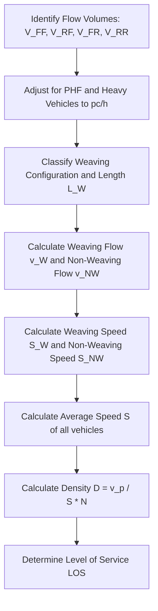

# Weaving Segments

A weaving segment is a length of highway where an entering movement and an exiting movement cross paths. This crossing of vehicles occurs without the aid of traffic signals or other control devices. Weaving segments are characterized by high turbulence, as vehicles must make lane changes over a limited distance.

The NCEES PE Civil Transportation exam frequently tests weaving segment operations. The methodology is governed by Chapter 13 of the Highway Capacity Manual (HCM 6th Edition) and is summarized in the NCEES PE Civil Reference Handbook.

---

## Weaving Segment Characteristics

To analyze a weaving segment, we must define its geometry and flow components:

* **Weaving Length ($L_W$)**: The physical distance (feet) from the gore point where the merge begins to the gore point where the diverge begins. Short weaving lengths increase turbulence and reduce capacity.
* **Weaving Flow Rate ($v_W$)**: The sum of the two crossing flows:
  $$v_W = v_{RF} + v_{FR}$$
  * $v_{RF}$ = flow originating on the ramp and exiting onto the freeway ($pc/h$)
  * $v_{FR}$ = flow originating on the freeway and exiting onto the ramp ($pc/h$)
* **Non-Weaving Flow Rate ($v_{NW}$)**: The sum of the two through-flows:
  $$v_{NW} = v_{FF} + v_{RR}$$
  * $v_{FF}$ = freeway-to-freeway through-flow ($pc/h$)
  * $v_{RR}$ = ramp-to-ramp through-flow ($pc/h$)
* **Total Flow Rate ($v$)**: The sum of all movements:
  $$v = v_W + v_{NW}$$
* **Volume Ratio ($VR$)**: The proportion of total traffic that consists of weaving vehicles:
  $$VR = \frac{v_W}{v}$$

---

## Weaving Configurations

The configuration determines the minimum number of lane changes that weaving vehicles must perform. The HCM classifies weaving segments based on these lane-change requirements:

### One-Sided Weaving Segments
The most common type. An on-ramp is followed closely by an off-ramp, and the two are connected by a continuous auxiliary lane. 
* Vehicles entering from the ramp must make **1 lane change** to enter the freeway ($L_{CR} = 1$).
* Vehicles exiting from the freeway must make **1 lane change** to enter the auxiliary lane ($L_{CF} = 1$).

### Two-Sided Weaving Segments
Occur when a left-side ramp is followed by a right-side ramp (or vice versa). Weaving vehicles must cross all lanes of the freeway.
* The number of lane changes required is equal to the number of freeway lanes. These configurations create extreme turbulence.

---

## Step-by-Step Analysis Methodology

---

## Step 1: Calculate Average Speed ($S$)

The HCM utilizes separate regression equations to estimate the average speed of weaving vehicles ($S_W$) and non-weaving vehicles ($S_{NW}$):

$$\text{Weaving Speed: } S_W = \text{BFFS} - \text{adjustments based on geometry and flow}$$
$$\text{Non-Weaving Speed: } S_{NW} = \text{BFFS} - \text{adjustments based on geometry and flow}$$

Once $S_W$ and $S_{NW}$ are determined, the average speed of the entire traffic stream ($S$, in $mph$) is calculated as a weighted harmonic mean:

$$S = \frac{v_W + v_{NW}}{\frac{v_W}{S_W} + \frac{v_{NW}}{S_{NW}}}$$

*Note: On the PE exam, the individual speeds $S_W$ and $S_{NW}$ are typically either given, or the problem will simplify the system so that you can apply the harmonic mean formula directly.*

---

## Step 2: Calculate Density ($D$)

Calculate the density of the weaving segment ($D$, in $pc/mi/ln$):

$$D = \frac{v}{S \times N}$$

Where:
* $v$ = total adjusted flow rate in the weaving segment ($pc/h$)
* $S$ = average speed of the traffic stream ($mph$)
* $N$ = number of lanes within the weaving segment (including the auxiliary lane, if present).

---

## Step 3: Determine Level of Service (LOS)

LOS for weaving segments is determined by density ($D$):

| Level of Service (LOS) | Density Range ($pc/mi/ln$) |
| --- | --- |
| **A** | $\le 10.0$ |
| **B** | $> 10.0$ to $\le 20.0$ |
| **C** | $> 20.0$ to $\le 28.0$ |
| **D** | $> 28.0$ to $\le 35.0$ |
| **E** | $> 35.0$ to $\le 43.0$ |
| **F** | $> 43.0$ OR if $v/c > 1.0$ |

*Note: The maximum density for LOS E in a weaving segment is $43.0 \text{ pc/mi/ln}$, which is slightly lower than the $45.0 \text{ pc/mi/ln}$ limit for basic freeway segments.*

---

## Critical Pitfalls and Exam Traps

1. **Incorrect Calculation of Weighted Speed**:
   A common error is calculating the average speed using a simple arithmetic mean: $S = (S_W + S_{NW})/2$. You **must** use the harmonic mean formula weighted by flow rates.

2. **Forgetting the Auxiliary Lane in $N$**:
   When counting the number of lanes ($N$) in the weaving segment, you must include the auxiliary lane that connects the on-ramp and off-ramp. If the freeway has 3 through-lanes and a 1-lane auxiliary lane connects the ramps, then $N = 4$.

3. **Confusing Weaving Flow components**:
   Ensure you identify the flows correctly:
   * Weaving flows ($v_W$) are the crossing movements: freeway-to-ramp and ramp-to-freeway.
   * Non-weaving flows ($v_{NW}$) are the through movements: freeway-to-freeway and ramp-to-ramp.

---

## Worked Example

A one-sided weaving segment on a freeway has the following adjusted peak passenger-car flow rates:
* Freeway-to-freeway through-flow: $v_{FF} = 2,800 \text{ pc/h}$
* Freeway-to-ramp exiting flow: $v_{FR} = 600 \text{ pc/h}$
* Ramp-to-freeway entering flow: $v_{RF} = 800 \text{ pc/h}$
* Ramp-to-ramp through-flow: $v_{RR} = 100 \text{ pc/h}$
* Number of lanes in the weaving segment (including auxiliary lane): $N = 4$
* Estimated average speed of weaving vehicles: $S_W = 42 \text{ mph}$
* Estimated average speed of non-weaving vehicles: $S_{NW} = 54 \text{ mph}$

**Determine the average speed ($S$) of the traffic stream, the density ($D$) of the segment, and the Level of Service (LOS).**

### Solution:

#### Step 1: Calculate Weaving and Non-Weaving Flow Rates
$$v_W = v_{RF} + v_{FR} = 800 + 600 = 1,400 \text{ pc/h}$$
$$v_{NW} = v_{FF} + v_{RR} = 2,800 + 100 = 2,900 \text{ pc/h}$$
$$v = v_W + v_{NW} = 1,400 + 2,900 = 4,300 \text{ pc/h}$$

#### Step 2: Calculate Weighted Average Speed ($S$)
Using the harmonic mean:
$$S = \frac{v_W + v_{NW}}{\frac{v_W}{S_W} + \frac{v_{NW}}{S_{NW}}} = \frac{4,300}{\frac{1,400}{42} + \frac{2,900}{54}}$$
* $\frac{1,400}{42} = 33.33$
* $\frac{2,900}{54} = 53.70$
$$S = \frac{4,300}{33.33 + 53.70} = \frac{4,300}{87.03} = 49.41 \text{ mph}$$

#### Step 3: Calculate Density ($D$)
$$D = \frac{v}{S \times N} = \frac{4,300 \text{ pc/h}}{49.41 \text{ mph} \times 4 \text{ lanes}} = \frac{4,300}{197.64} = 21.76 \text{ pc/mi/ln}$$

#### Step 4: Determine Level of Service (LOS)
Compare $D = 21.76 \text{ pc/mi/ln}$ to the weaving segment LOS criteria:
* $20.0 < D \le 28.0 \rightarrow$ **LOS C**

**Conclusion:** The weaving segment operates at **LOS C**.

---

## References and Standards
* *NCEES PE Civil Reference Handbook*, Section 6.2 (Traffic Operations).
* *Highway Capacity Manual (HCM) 6th Edition*, Chapter 13 (Freeway Weaving Segments).
