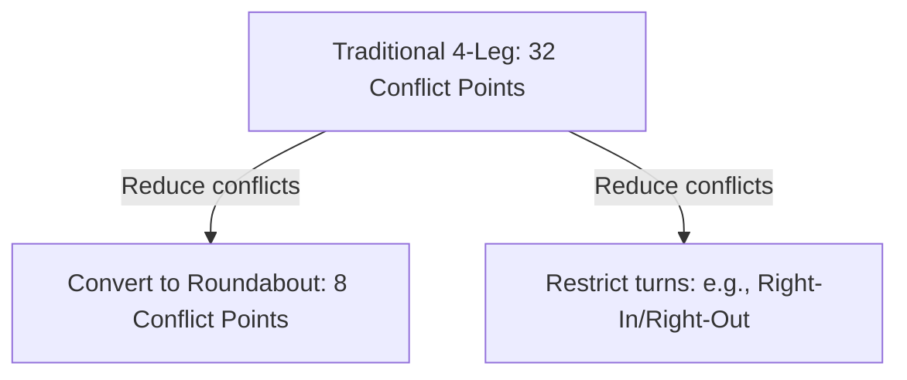

# Conflict Analysis

Conflict analysis is a proactive traffic safety methodology that evaluates "near-miss" events instead of waiting for historical crash data to accumulate. A traffic conflict is an event involving two or more road users where an unexpected maneuver by one user forces another to take evasive action (such as braking or swerving) to avoid a collision.

On the NCEES PE Civil Transportation exam, conflict analysis is tested conceptually through surrogate safety measures and quantitatively through the calculation of conflict points for different intersection configurations.

---

## Surrogate Safety Measures

Since crashes are rare, random events, safety engineers use surrogate safety measures to quantify the level of risk on a roadway:

* **Time-to-Collision (TTC)**: The time remaining before a collision would occur if the two vehicles continued on their present trajectories and speeds:
  $$\text{TTC} = \frac{d}{\Delta v}$$
  *where $d$ is the distance between vehicles and $\Delta v$ is the relative speed. A lower TTC indicates a more severe conflict.*
* **Post-Encroachment Time (PET)**: The time interval between the departure of an encroaching vehicle from a common conflict area and the arrival of a second vehicle with priority at that same area:
  $$\text{PET} = t_{\text{arrival}} - t_{\text{departure}}$$
  *PET is easier to measure in the field than TTC because it does not require continuous tracking of vehicle speeds.*
* **Deceleration Rate to Avoid Crash (DRAC)**: The deceleration rate required by a vehicle to come to a stop or slow down sufficiently to avoid colliding with an encroaching vehicle.

---

## Intersection Conflict Points

An intersection's conflict points are locations where vehicle trajectories merge, diverge, or cross. The number of conflict points is a primary indicator of intersection safety: the fewer the conflict points, the safer the intersection.

There are three types of conflicts:
1. **Crossing Conflicts**: Vehicle paths cross at right or oblique angles. These are the most severe conflicts, often resulting in T-bone (angle) or head-on crashes.
2. **Merging Conflicts**: Vehicle paths converge (vehicles join the same stream). Typically result in rear-end or sideswipe crashes.
3. **Diverging Conflicts**: Vehicle paths split (vehicles leave a stream). Typically result in rear-end crashes due to deceleration.

### Conflict Point Comparison Table
For standard intersections with single lanes on all approaches and no turn restrictions:

| Intersection Type | Crossing Conflicts | Merging Conflicts | Diverging Conflicts | Total Conflict Points |
| --- | --- | --- | --- | --- |
| **Standard 4-Leg Intersection** | 16 | 8 | 8 | **32** |
| **Standard 3-Leg (T) Intersection** | 3 | 3 | 3 | **9** |
| **Single-Lane Roundabout** | 0 | 4 | 4 | **8** |

### Why Roundabouts are Safer
A single-lane roundabout has **zero crossing conflicts** and only 8 total conflicts. All movements entering the roundabout yield and merge in the same direction, eliminating high-severity crossing maneuvers.

---

## Critical Pitfalls and Exam Traps

1. **Double-Counting Merge and Diverge Points**:
   When diagramming conflict points manually, be careful not to double-count. A merge point is where two paths become one; a diverge point is where one path becomes two. Ensure you draw the arrows showing direction of travel to distinguish them clearly.

2. **Underestimating Multi-Lane Intersection Conflicts**:
   The standard "32 conflict points" rule only applies to a single-lane 4-leg intersection. If an intersection has multiple lanes (e.g., dual left-turn lanes, or multiple through-lanes), the number of conflict points increases significantly because vehicles in adjacent lanes can conflict.

3. **Confusing TTC and PET Definitions**:
   * **TTC** assumes speeds and trajectories *remain constant* and calculates the time to impact.
   * **PET** measures the *actual* time difference between when one vehicle leaves a spot and another vehicle enters it, regardless of whether they had to brake.

---

## Worked Example

An agency is considering converting a standard 4-leg intersection (single lanes on all approaches, full turn movements allowed) into a 3-leg T-intersection by closing the North approach.

**Compare the total number of conflict points and the number of crossing conflict points before and after this modification.**

### Solution:

#### Step 1: Identify Initial Conflict Points (4-Leg Intersection)
For a standard single-lane 4-leg intersection:
* Crossing conflicts: $16$
* Merging conflicts: $8$
* Diverging conflicts: $8$
* **Total conflicts: $32$**

#### Step 2: Identify Modified Conflict Points (3-Leg T-Intersection)
Closing the North approach removes all movements originating from or destined to the North. The remaining approaches are South, East, and West:
* Crossing conflicts: $3$ (South left-turn crossing Westbound, Westbound left-turn crossing Eastbound, and South left-turn crossing Eastbound).
* Merging conflicts: $3$ (South right-turn merging Eastbound, South left-turn merging Westbound, and Westbound left-turn merging Westbound).
* Diverging conflicts: $3$ (Eastbound right-turn diverging South, Westbound left-turn diverging South, and Eastbound left-turn diverging South).
* **Total conflicts: $9$**

#### Step 3: Compare Results
* **Total Conflict Reduction**:
  $$\Delta \text{Total} = 32 - 9 = 23 \text{ conflict points (71.9% reduction)}$$
* **Crossing Conflict Reduction**:
  $$\Delta \text{Crossing} = 16 - 3 = 13 \text{ crossing points (81.3% reduction)}$$

**Conclusion:** Converting the intersection to a 3-leg T-intersection reduces the total conflict points from $32$ to $9$, and reduces high-severity crossing conflicts from $16$ to $3$.

---

## References and Standards
* *NCEES PE Civil Reference Handbook*, Section 6.3 (Traffic Safety).
* *Highway Safety Manual (HSM) 1st Edition*, Chapter 3 (Fundamentals).
