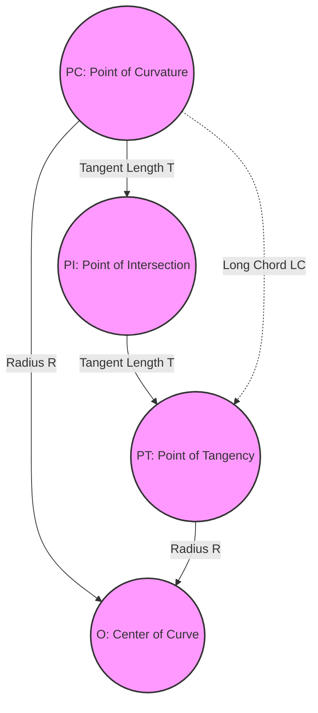

# Circular Curve Fundamentals

Horizontal curves provide smooth transitions between tangent sections of a highway. A simple horizontal curve is a circular arc of constant radius connecting two tangents. For the PE Civil Transportation exam, horizontal alignment calculations are based on the equations found in the **NCEES PE Civil Reference Handbook** and design criteria in **AASHTO's Green Book (GDHS)**, Chapter 3.

---

## Circular Curve Geometry and Terms

Understanding the spatial layout and definitions of horizontal curve components is critical. 

### Definitions:
*   **PI (Point of Intersection):** The point where the back tangent and forward tangent intersect.
*   **PC (Point of Curvature):** The point where the alignment changes from a tangent to the circular curve (beginning of the curve).
*   **PT (Point of Tangency):** The point where the alignment changes from the circular curve to a tangent (end of the curve).
*   **$\Delta$ or $I$ (Deflection Angle / Central Angle):** The angle of intersection between the back and forward tangents, which is equal to the central angle subtended by the circular arc.
*   **$R$ (Radius):** The radius of the circular arc.
*   **$T$ (Tangent Length):** The distance from PC to PI, or from PI to PT.
*   **$L$ (Length of Curve):** The length of the circular arc from PC to PT.
*   **$LC$ (Long Chord):** The straight-line distance from PC to PT.
*   **$E$ (External Distance):** The distance from the PI to the midpoint of the curve along the radial line connecting the PI to the curve center.
*   **$M$ (Middle Ordinate):** The distance from the midpoint of the curve to the midpoint of the long chord.

---

## Degree of Curve ($D$)

Degree of curve is a measure of the sharpness of a curve. There are two standard definitions:

### 1. Arc Definition ($D_a$)
The degree of curve is the central angle subtended by a circular arc of exactly **$100\text{ ft}$**. This definition is used exclusively in highway engineering.
$$D_a = \frac{360^\circ \times 100\text{ ft}}{2 \pi R} \approx \frac{5729.58}{R}$$

### 2. Chord Definition ($D_c$)
The degree of curve is the central angle subtended by a straight chord of exactly **$100\text{ ft}$**. This definition is used in railway engineering.
$$R = \frac{50}{\sin\left(\frac{D_c}{2}\right)}$$

---

## Fundamental Circular Curve Formulas

The following geometric relationships are used to calculate the properties of a simple circular curve. Ensure your calculator is set to **Degree Mode** for all trigonometric functions.

| Parameter | Formula | Alternative Form |
| :--- | :--- | :--- |
| **Radius ($R$)** | $$R = \frac{5729.58}{D_a}$$ *(Arc)* | $$R = \frac{50}{\sin(D_c/2)}$$ *(Chord)* |
| **Tangent ($T$)** | $$T = R \tan\left(\frac{\Delta}{2}\right)$$ | |
| **Curve Length ($L$)** | $$L = R \Delta \left(\frac{\pi}{180}\right)$$ | $$L = \frac{100 \Delta}{D_a}$$ |
| **Long Chord ($LC$)** | $$LC = 2 R \sin\left(\frac{\Delta}{2}\right)$$ | |
| **External Distance ($E$)** | $$E = R \left( \sec\left(\frac{\Delta}{2}\right) - 1 \right)$$ | $$E = R \left( \frac{1}{\cos(\Delta/2)} - 1 \right)$$ |
| **Middle Ordinate ($M$)** | $$M = R \left( 1 - \cos\left(\frac{\Delta}{2}\right) \right)$$ | $$M = E \cos\left(\frac{\Delta}{2}\right)$$ |

---

## Worked Example: Full Curve Parameter Calculation

### Problem Statement
A simple horizontal circular curve is designed to connect two highway tangents. The deflection angle ($\Delta$) at the Point of Intersection (PI) is $42^\circ 30'$. The degree of curve ($D_a$, arc definition) is specified as $4.5^\circ$.

1.  Calculate the radius ($R$) of the curve.
2.  Find the tangent length ($T$).
3.  Calculate the length of the curve ($L$).
4.  Find the long chord length ($LC$).
5.  Determine the external distance ($E$) and middle ordinate ($M$).

### Solution
1.  **Calculate the Radius ($R$):**
    Using the arc definition:
    $$R = \frac{5729.58}{D_a} = \frac{5729.58}{4.5} = 1273.24\text{ ft}$$

2.  **Calculate the Tangent Length ($T$):**
    Convert $\Delta$ to decimal degrees: $\Delta = 42^\circ + \frac{30'}{60} = 42.5^\circ$.
    $$T = R \tan\left(\frac{\Delta}{2}\right) = 1273.24 \tan\left(\frac{42.5^\circ}{2}\right)$$
    $$T = 1273.24 \tan(21.25^\circ) = 1273.24 \times 0.38888 = 495.14\text{ ft}$$

3.  **Calculate the Curve Length ($L$):**
    Using the degree of curve formula:
    $$L = \frac{100 \Delta}{D_a} = \frac{100 \times 42.5}{4.5} = 944.44\text{ ft}$$
    *Double-check with arc length formula:*
    $$L = R \Delta \left(\frac{\pi}{180}\right) = 1273.24 \times 42.5 \times 0.0174533 = 944.44\text{ ft}$$ (Matches!)

4.  **Calculate the Long Chord ($LC$):**
    $$LC = 2 R \sin\left(\frac{\Delta}{2}\right) = 2 \times 1273.24 \sin(21.25^\circ)$$
    $$LC = 2546.48 \times 0.36244 = 922.94\text{ ft}$$

5.  **Calculate the External Distance ($E$) and Middle Ordinate ($M$):**
    *   **External Distance ($E$):**
        $$E = R \left( \frac{1}{\cos(\Delta/2)} - 1 \right) = 1273.24 \left( \frac{1}{\cos(21.25^\circ)} - 1 \right)$$
        $$E = 1273.24 \left( \frac{1}{0.93201} - 1 \right) = 1273.24 \times (1.07295 - 1) = 1273.24 \times 0.07295 = 92.88\text{ ft}$$
    *   **Middle Ordinate ($M$):**
        $$M = R \left( 1 - \cos\left(\frac{\Delta}{2}\right) \right) = 1273.24 (1 - \cos(21.25^\circ))$$
        $$M = 1273.24 (1 - 0.93201) = 1273.24 \times 0.06799 = 86.57\text{ ft}$$
        *Check relation:* $M = E \cos(\Delta/2) = 92.88 \times \cos(21.25^\circ) = 92.88 \times 0.93201 = 86.56\text{ ft}$ (Rounding agreement).

### Answer
*   Radius ($R$): **1,273.24 ft**
*   Tangent ($T$): **495.14 ft**
*   Length of curve ($L$): **944.44 ft**
*   Long Chord ($LC$): **922.94 ft**
*   External Distance ($E$): **92.88 ft**
*   Middle Ordinate ($M$): **86.57 ft**

---

## Crucial Exam Tips

*   **Calculator Angle Settings:** A common error is evaluating trigonometric functions in radians instead of degrees. Ensure your calculator displays "DEG".
*   **Arc vs. Chord Degree of Curve:** If the problem does not specify, **always** assume highway design (arc definition: $R = 5729.58/D$). Only use chord definition if the problem specifically mentions railroads or track design.
*   **Subdividing Deflection Angle:** Make sure to divide $\Delta$ by 2 in the functions for $T$, $LC$, $E$, and $M$ ($T = R \tan(\Delta/2)$, etc.). Forgetting to divide $\Delta$ by 2 is a very common distractor choice in multiple-choice questions.
